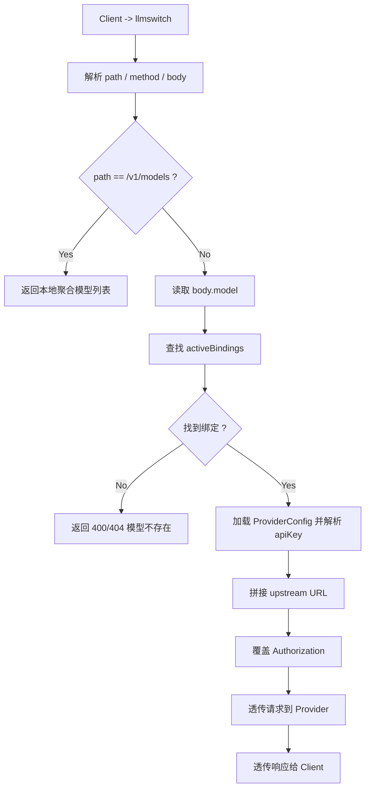

# 功能拆分

基于 [FEATURES.md](/Users/morlay/src/github.com/morlay/llmswitch/FEATURES.md) 的当前描述，可以把 `llmswitch` 拆成 5 个主模块，按「先代理核心、后桌面交互」的顺序实现。

## 1. 产品目标

- 这是一个 macOS 状态栏工具。
- 用户可以配置多个 OpenAI 兼容的 LLM Provider。
- 本地暴露一个统一的 OpenAI 兼容 API 入口。
- 请求按 `model` 路由到对应 Provider，并自动注入该 Provider 的 `apiKey`。
- 不做统计、不做计费、不做内容改写，只做模型路由和透明转发。

## 2. 模块拆分

### 2.1 配置管理

职责：

- 读取主配置文件 `~/.config/llmswitch/config.toml`
- 校验 Provider 配置是否合法
- 支持 `apiKey` 直接写死或 `env:ENV_NAME` 动态读取
- 支持 `http` / `https` 的 `baseUrl`
- 提供运行时只读配置对象给 UI 和代理服务使用

建议配置项：

- 应用级配置
  - 监听地址
  - 模型刷新周期
  - 请求超时
- Provider 级配置
  - `displayName`
  - `baseUrl`
  - `apiKey`
  - 是否启用

### 2.2 模型发现与缓存

职责：

- 调用各 Provider 的 `/v1/models`
- 拉取成功后缓存到本地
- 将 Provider 返回的模型列表标准化
- 支持手动刷新和定时刷新
- Provider 不可用时优先展示最近一次缓存

路径约定：

- `CONFIG_ROOT = ~/.config/llmswitch`

建议缓存目录：

- `{CONFIG_ROOT}/cache/{provider_name}/`

建议缓存文件：

- `{CONFIG_ROOT}/cache/{provider_name}/models.json`
- `{CONFIG_ROOT}/cache/{provider_name}/meta.json`

缓存内容建议包含：

- Provider 名称
- 拉取时间
- 原始模型 ID 列表
- 本次拉取是否成功
- 最近一次错误信息

### 2.3 用户状态与模型选择

职责：

- 保存用户勾选的常用模型
- 保存同名模型当前选择的是哪个 Provider
- 保持用户状态和 `config.toml` 分离
- 在 Provider 模型列表变化后尽量保留原有选择

建议状态文件：

- `{CONFIG_ROOT}/state.toml`

状态建议拆成两层：

- `enabledModels`
  - 用户允许在本地代理暴露出来的模型
- `activeBindings`
  - 同名模型当前绑定到哪个 Provider

示例：

```toml
[enabledModels]
"gpt-4.1" = true
"gpt-4.1-mini" = true
"deepseek-chat" = true

[activeBindings."gpt-4.1"]
provider = "openai"
upstreamModel = "gpt-4.1"

[activeBindings."gpt-4.1-mini"]
provider = "openai"
upstreamModel = "gpt-4.1-mini"

[activeBindings."deepseek-chat"]
provider = "deepseek"
upstreamModel = "deepseek-chat"
```

### 2.4 状态栏与设置界面

职责：

- 提供 settings UI 管理 Provider
- 展示用户已启用的模型
- 对同名模型提供 Provider 切换入口
- 支持刷新模型列表
- 支持启动/停止本地代理服务

设置 UI 建议拆分：

- Provider 列表页
  - 新增、编辑、删除 Provider
  - 测试连通性
- 模型管理页
  - 展示每个 Provider 拉到的模型
  - 勾选哪些模型暴露到本地
  - 同名模型选择默认 Provider
- 服务设置页
  - 监听地址
  - 端口
  - 开机启动

状态栏菜单建议包含：

- 当前服务监听地址
- 已启用模型列表
- 每个同名模型当前绑定的 Provider
- 刷新模型
- 打开设置
- 退出

### 2.5 OpenAI 兼容代理服务

职责：

- 本地监听可配置端口
- 对外提供 OpenAI 兼容接口
- 根据 `model` 决定转发目标 Provider
- 覆盖上游 `Authorization` 请求头
- 透传请求体、响应体和流式响应
- 本地 `/v1/models` 返回已启用模型列表

建议代理行为：

- `GET /v1/models`
  - 不直接透传上游
  - 返回本地聚合后的可用模型列表
- `POST /v1/*`
  - 读取请求体中的 `model`
  - 查找 `activeBindings`
  - 将请求转发到 `provider.baseUrl + 原始路径`
  - 替换 `Authorization: Bearer <provider api key>`
  - 保留原始请求体，不改写业务参数
- 流式接口
  - 直接透传字节流
  - 不做分段解析和重组

## 3. 配置文件设计

主配置文件：

- 路径：`{CONFIG_ROOT}/config.toml`
- 原则：只放静态配置，不放用户运行态选择

建议目录结构：

```text
{CONFIG_ROOT}/
  config.toml
  state.toml
  cache/
    openai/
      models.json
      meta.json
    deepseek/
      models.json
      meta.json
```

示例：

```toml
[app]
listen = "127.0.0.1:8787"
modelRefreshIntervalSeconds = 300
requestTimeoutSeconds = 600

[providers.openai]
displayName = "OpenAI"
baseUrl = "https://api.openai.com"
apiKey = "env:OPENAI_API_KEY"
enabled = true

[providers.openrouter]
displayName = "OpenRouter"
baseUrl = "https://openrouter.ai/api"
apiKey = "env:OPENROUTER_API_KEY"
enabled = true

[providers.deepseek]
displayName = "DeepSeek"
baseUrl = "https://api.deepseek.com"
apiKey = "env:DEEPSEEK_API_KEY"
enabled = true

[providers.local]
displayName = "Local Gateway"
baseUrl = "http://127.0.0.1:11434"
apiKey = "local-dev-token"
enabled = false
```

`apiKey` 建议支持两种写法：

- 直接值：`apiKey = "sk-xxx"`
- 环境变量：`apiKey = "env:OPENAI_API_KEY"`

解析规则建议：

- 以 `env:` 开头时，读取对应环境变量
- 环境变量不存在时，该 Provider 标记为不可用
- 不要把解析结果回写到配置文件

## 4. 数据模型拆分

核心对象建议如下：

- `AppConfig`
  - 应用级配置
- `ProviderConfig`
  - 单个 Provider 的静态配置
- `ProviderModel`
  - 某个 Provider 返回的一个模型
- `ModelRegistry`
  - 聚合后的模型注册表
- `ActiveBinding`
  - `public model name -> provider + upstream model`
- `ProxyTarget`
  - 某次请求最终要转发到的目标地址和鉴权信息

最关键的映射关系是：

```text
用户请求 model
-> 本地公开模型名
-> activeBindings[model]
-> provider + upstreamModel
-> 最终转发地址和 apiKey
```

## 5. 转发流程



建议的详细步骤：

1. 客户端请求本地 `llmswitch`。
2. 如果是 `GET /v1/models`，直接返回本地模型注册表中的已启用模型。
3. 否则解析请求 JSON 中的 `model` 字段。
4. 用 `model` 查询 `activeBindings`，找到对应 Provider 和上游模型名。
5. 从 `ProviderConfig` 解析 `baseUrl` 和 `apiKey`。
6. 将请求转发到上游相同路径，例如 `/v1/chat/completions`。
7. 覆盖 `Authorization`，其余业务参数原样透传。
8. 如果是流式响应，直接将上游流转发给客户端。

## 6. 推荐实现顺序

### 第一阶段：核心代理可用

目标：

- 能读配置
- 能拉取模型列表
- 能保存用户选择
- 能本地监听并转发请求

交付物：

- 配置解析模块
- 模型拉取和缓存模块
- 本地代理服务
- 最小可用的状态文件

### 第二阶段：状态栏可用

目标：

- 菜单栏能看到已启用模型
- 可以切换同名模型的 Provider
- 可以手动刷新模型

交付物：

- 状态栏菜单
- 状态读写
- 刷新动作

### 第三阶段：设置面板可用

目标：

- 可以在 UI 中管理 Provider
- 可以测试连通性
- 可以勾选要暴露的模型

交付物：

- Provider 管理页
- 模型管理页
- 服务设置页

## 7. MVP 与非目标

MVP 建议先做：

- 配置文件读取
- 多 Provider 模型发现
- 已启用模型聚合
- 同名模型绑定
- `/v1/models` 本地聚合接口
- `/v1/*` 通用透明代理

先不要做：

- 请求统计
- Token 计费
- 负载均衡
- 自动重试
- 模型能力分析
- 非 OpenAI 兼容协议适配

## 8. Swift 实现评估

结论：

- Swift 可以胜任这个项目。
- 不需要额外引入 Go / Rust / Node 之类的旁路技术栈。
- HTTP streaming 不是阻塞点，真正有实现成本的是本地 HTTP server 这一层。

### 8.1 哪些部分 Swift 很适合

- macOS 状态栏和设置界面
  - `SwiftUI + AppKit`
- 配置和状态管理
  - `Foundation`
- 上游模型发现
  - `URLSession`
- 本地缓存文件
  - `FileManager`
- 后台刷新和应用内状态同步
  - `async/await`、`Task`、`Actor`

### 8.2 HTTP Streaming 可行性

上游到本地代理的流式转发，Swift 是可以做的。

原因：

- OpenAI 兼容流式接口本质上是普通 HTTP 响应体持续输出数据，通常是 SSE 文本流。
- Swift 的 `URLSession` 可以按字节或按片段持续读取响应，而不必等整个响应完成。
- 因为这里的需求是“透明转发”，不需要在流中做复杂改写，所以实现难度可控。

对这个项目来说，流式路径可以简化成：

```text
Client -> 本地 HTTP 服务
本地 HTTP 服务 -> URLSession 请求上游
上游持续返回字节流
本地 HTTP 服务持续写回给 Client
```

这条链路不要求解析完整 SSE 协议，只要做到：

- 正确保留响应状态码和关键响应头
- 以增量方式把上游字节写给下游
- 上游结束时正常关闭本地响应

### 8.3 真正需要评估的是本地 HTTP 服务

如果要求“整个项目都只用 Swift”，这里有两种做法。

方案 A：纯 Apple 框架，自建轻量 HTTP server

- 使用 `Network.framework` 的 `NWListener` / `NWConnection`
- 自己处理最小必要的 HTTP/1.1 解析
- 只支持项目需要的接口：
  - `GET /v1/models`
  - `POST /v1/chat/completions`
  - 以及其他 `POST /v1/*`
- 流式响应时输出 `Transfer-Encoding: chunked` 或等价的持续写回逻辑

优点：

- 没有额外语言栈
- 没有额外服务进程
- 二进制分发最简单

缺点：

- HTTP 解析、连接复用、边界条件都要自己兜住
- 代码量不大，但细节容易出错

方案 B：仍然是 Swift，但引入轻量 Swift server 库

- 例如 `SwiftNIO` 或基于它的轻量 HTTP server
- UI、配置、代理逻辑仍全部写在 Swift 内

优点：

- 本地服务和 streaming 会更稳
- 边界条件少很多

缺点：

- 会多一个 Swift 依赖
- 工程复杂度略高于纯 Apple 框架

### 8.4 建议结论

如果你的目标是“不要引入其他语言或额外守护进程”，Swift 完全可以直接做。

如果你的目标还是“尽量少依赖”，我的建议是：

- 第一阶段仍然坚持单技术栈 Swift
- UI 用 `SwiftUI + AppKit`
- 上游 HTTP client 用 `URLSession`
- 本地服务先做一个最小 HTTP/1.1 server，只覆盖本项目需要的几个接口
- 等代理路径稳定后，再决定是否要把 server 层替换成更成熟的 Swift 库

换句话说：

- “Swift 能不能做 streaming” 的答案是可以
- “要不要上其他技术栈” 的答案是不用
- “要不要上第三方 Swift HTTP server” 则取决于你对开发速度和长期维护成本的取舍

## 9. 建议的代码目录

如果接下来开始实现，建议直接按职责分目录：

```text
llmswitch/
  FEATURES.md
  FEATURE_BREAKDOWN.md
  cmd/
    llmswitch/
  internal/
    config/
    provider/
    registry/
    state/
    proxy/
    menubar/
    settings/
```

这样拆分后，依赖方向会比较清晰：

- `config` / `state` 提供数据
- `provider` 负责上游发现
- `registry` 负责模型聚合与绑定
- `proxy` 负责请求转发
- `menubar` / `settings` 只是 UI 层
